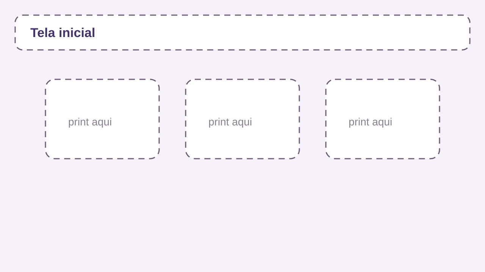
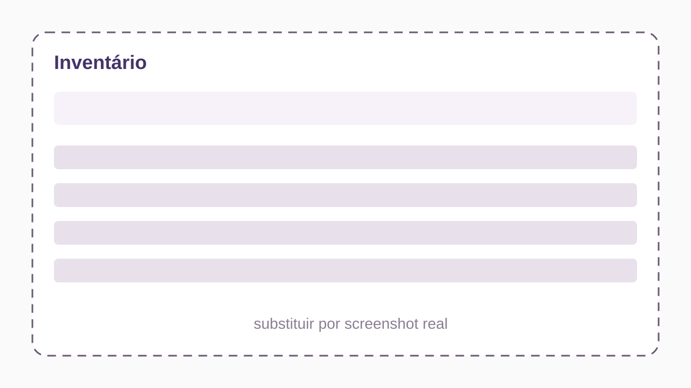
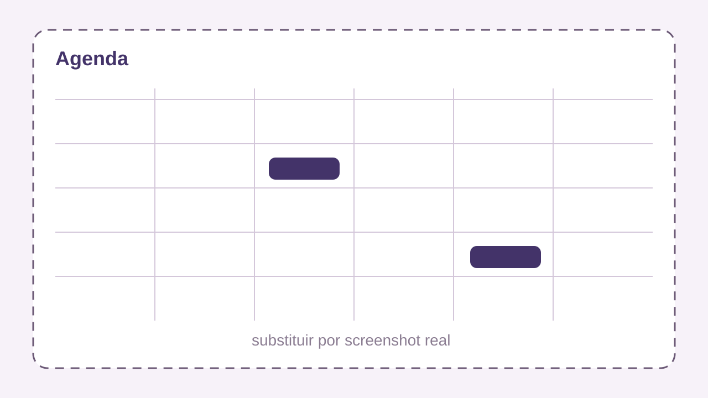
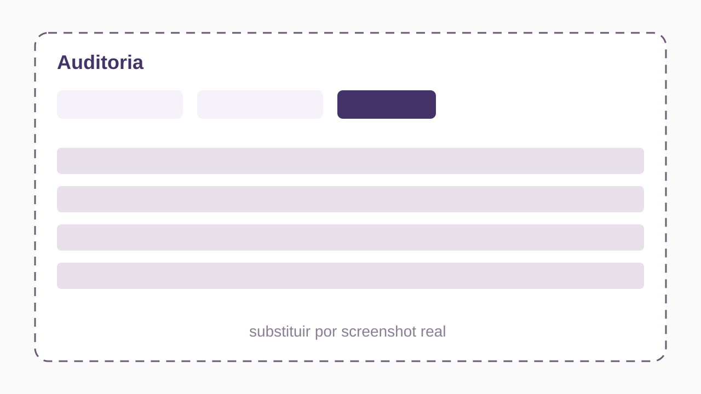
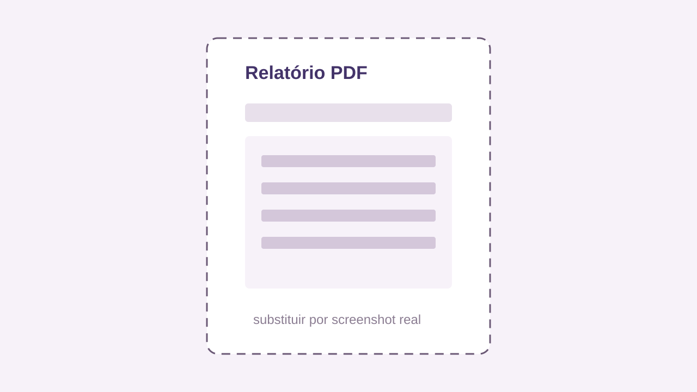

# THOTH - Sistema de Gestão Laboratorial

O THOTH é um sistema web para gestão laboratorial, criado para auxiliar no controle de reagentes, vidrarias, utensílios, compatibilidade de materiais, geração de relatórios e organização de agendamentos.

> Este repositório apresenta o projeto em nível de produto.
> O código-fonte é privado.

## Visão Geral

O sistema foi desenvolvido com foco em ambientes laboratoriais educacionais, permitindo maior organização, rastreabilidade e controle sobre os recursos disponíveis.

O THOTH centraliza informações que normalmente ficam espalhadas em planilhas, documentos ou registros manuais, ajudando equipes de laboratório a manter inventário, agenda e consultas de segurança em um único ambiente.

## Principais Funcionalidades

- Controle de reagentes.
- Controle de vidrarias.
- Controle de utensílios.
- Registro de eventos e movimentações.
- Geração de relatórios em PDF.
- Agenda de uso laboratorial.
- Verificação de compatibilidade entre materiais.
- Organização de inventário por categorias.
- Controle de usuários e permissões.
- Consulta de histórico por auditoria.

## Prévia Visual

Os arquivos abaixo são placeholders para os prints finais do sistema. Substitua cada SVG por uma captura real mantendo o mesmo nome, se quiser que o README atualize automaticamente.

| Tela inicial | Inventário | Agenda |
|---|---|---|
|  |  |  |

| Auditoria | Relatórios | Demonstração |
|---|---|---|
|  |  |  |

## Tecnologias Utilizadas

- Java.
- Spring Boot.
- Thymeleaf.
- MySQL.
- Spring Security.
- JPA/Hibernate.
- iTextPDF.
- Docker.

## Status do Projeto

Projeto desenvolvido como sistema de gestão laboratorial, com aplicação acadêmica e potencial de uso institucional.

## Código-Fonte

O código-fonte não está disponível publicamente.

Para solicitações institucionais, demonstrações ou validação de autoria, entre em contato com o autor.

## Documentação

- [Apresentação](docs/apresentacao.md)
- [Funcionalidades](docs/funcionalidades.md)
- [Arquitetura](docs/arquitetura.md)
- [Segurança](docs/seguranca.md)
- [Roadmap](docs/roadmap.md)
- [Changelog](docs/changelog.md)

## Capturas de Tela

As imagens do sistema podem ser adicionadas ou substituídas em:

- `assets/screenshots/`
- `assets/demo/`
- `assets/logo/`

## Autores

- João Pedro Medrado Pacheco
- João Lucas Nasio Marques
- Augusto Reis de Almeida
- Keven Rafael da Costa Vidal

## Direitos

© jpachec0. Todos os direitos reservados.

Este repositório é destinado apenas à apresentação do projeto THOTH.
O código-fonte, banco de dados, scripts internos e regras de implementação são privados.
